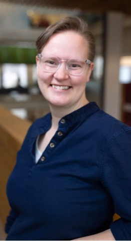

:::: {.columns}

::: {.column width="56%"}

I'm **Fiona Burlig**, an assistant professor at the Harris School of Public Policy at the University of Chicago. I am an applied microeconomist working at the intersection of energy, environmental, and resource economics, development economics, and agricultural economics.

Faculty Research Fellow, <a href="https://www.nber.org/people/fiona_burlig">NBER</a> (EEE and DEV) · Scholar, <a href="https://climate.uchicago.edu/people/fiona-burlig/">ICSG</a> · Affiliate, <a href="https://www.povertyactionlab.org/person/burlig">J-PAL</a>, <a href="https://www.ibread.org/who-we-are">BREAD</a>, and <a href="https://www.theigc.org/people/fiona-burlig">IGC</a> · Deputy Faculty Director, <a href="https://epic.uchicago.in/people/fiona-burlig/">EPIC-India</a> and the Odisha Data, Policy, and Innovation Centre

### selected research



:::

::: {.column width="5%"}
:::

::: {.column width="39%" .headshot}

{fig-alt="Fiona Burlig"}

:::

::::
